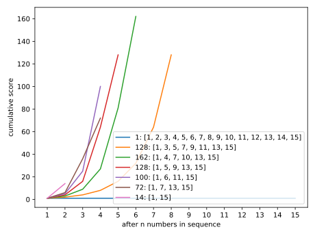
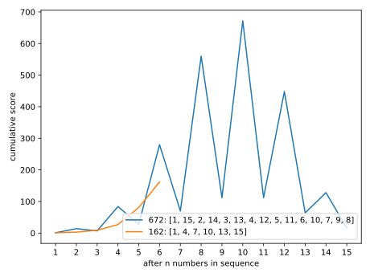
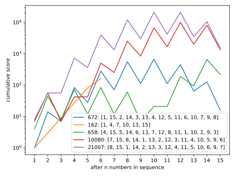
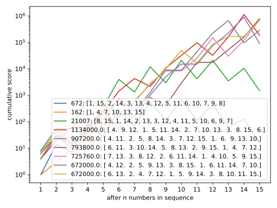
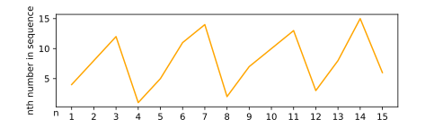
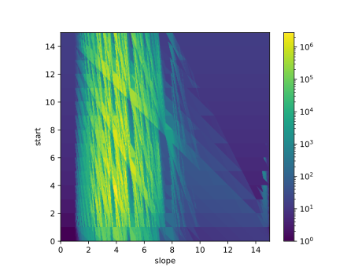
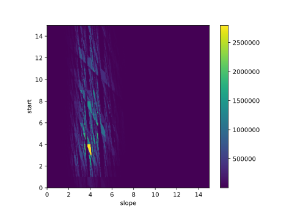
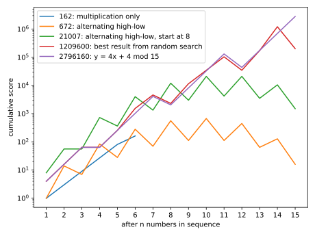

# Matrix Pool Solution

Matrix Pool is a single-player pool variant where you are trying to get a high
score. The balls are numbered 1 through 15. You can hit them in in any order. If
you sink one, you go again, and if you scratch, the game is over. Your score is
calculated like this:

When you sink a ball:

* If it's your first ball, you get that many points
* If it's value is greater than your last ball, *multiply* your score by the
*difference*
* If it's value is less than your last ball, *divide* your score by its value
(not the difference)

This gives rise to an interesting math problem: What is the optimal order to
hit the balls in and how many points is it possible to get?

The game of pool is really extraneous to this problem. You can rephrase it as
"How can you order a subset of the numbers from 1 to 15 to maximize this score
function?"

## Problem space

First of all, how many possible orders are there? When we say "orders", We are
taking about *permutations* of the set, so we can use the formula:

=\frac{n!}{(n-k)!})

where

* *n* = size of our set to pick from (15)
* *k* = number of items to pick (&le; 15) (remember, we can choose to scratch at
any time to end the game, so we could use less than 15 numbers.
* *P(n, k)* = the number of possible permutations.

!}}=3554627472076\approx3.5\times10^12\approx2^42)

That's a lot of possibilities! (About 3 trillion) Computers are really fast but 
even using multiple powerful computers to check every possible permutation could
take months or years. I calculated that with my (kind of slow) code running on my
laptop, it would take about 2.5 years of constant computation. 
So it looks like just trying every combination is not a workable solution. We
will need to try to think of patterns that might get good results and then check
those.

## Solution

First, I had some ideas of orders that might be good, but I needed a fast way to
test them. Thankefully, the rules are very simple, so this tiny bit of Python
code does the trick:

```python
# calculates the cumulative score after each number in the given order
def apply_rules(order):
    cumulative_score = []  # keep track of how many points we have after each number in the order
    last_number = None     # keep track what the last number in the order was
    for n in order:
        if last_number is None:
            cumulative_score.apend(n)
            
        elif n < last_number:
            current_score = cumulative_score[-1]
            cumulative_score.apend(current_score / n)
            
        else: # n > last_number
            difference = n - last_number
            current_score = cumulative_score[-1]
            cumulative_score.apend(current_score * difference)
            
        last_number = n
        
    return cumulative_score

# For example:
order = [1, 2, 3, 4, 5, 6, 7, 8, 9, 10, 11, 12, 13, 14, 15]
print(apply_rules(order))
# prints [1, 1, 1, 1, 1, 1, 1, 1, 1, 1, 1, 1, 1, 1, 1]
```

### First guesses

Right off the bat, it's easy to see that if sink all the balls in order your
score will always be `1` (you are multiplying by a difference of 1 at each step).
In order to get points, you'll need to skip some numbers.

#### Multiply-only

My first idea was to use every other number or every third number up until 15
and then intentionally scratch so you never have to divide.



This graph shows every multiply-only strategy. The legend shows the the maximum
(final) score of each sequence along with the sequence itself. The lines show
the cumulative scores over time. 

The best sequence in this strategy is the green line (every third number plus 15)
with a score of `162`.

It's not hard to see that we can do better, though. Intuitively, it's a bad sign
that we are not using over half of the numbers we have available -- there should
be some way to get some points out of those.

#### Alternate high-low

My next idea was to alternate high and low numbers. For example, if we start
with **1**, the next number should be **15** to maximize the difference, and the
next number should be **2** to minimize the amount we have to  divide by).
Then **14**, **3**, **13**, etc.

This gets much better results than our previous best:



The final score is lower (just `16`) but if you stop after 10 balls you can get
a score of `672`.

You might notice that it seems like a waste to start with 1 since you never get
to use it to divide with. You can improve on this strategy by "rotating" the
lower 8 numbers or just switching which number you start with.

I have switched to a logarithmic scale to compare some of these:



It seems like starting with 8 is the best order for this strategy, and gets you
`21007` points! (If you stop after 10 balls).

Still, though, there are 5 numbers that are unused. After the first 10 balls, we
are left with a bunch of middle numbers that are very difficult to get any
points out of.

## Exhaustive search

At this point, I wasn't sure how to find a faster solution, or if there was
one. As we discovered earlier, checking each of the 3 trillion possible orders
would take too long. But, we can still use the computer to try some random
guesses. I was able to check 1 million totally random guesses in just 30 seconds.

I graphed the best of them along with some of our previous solutions:



First of all, they are doing *a lot* better than any of my initial solution ideas.

Secondly, there seems to be a consistent strategy that **all** of the best random
guesses are following. Look at the best order from this run:

`[4, 8, 12, 1, 5, 11, 14, 2, 7, 10, 13, 3, 8, 15, 6]`

The numbers are ordered in a "saw-tooth" pattern with small runs of 3-4
increasing numbers before resetting to a low number. In a graph, that would look
like this:



Logically, it makes sense that this strategy would yeild the best solution. In
the alternating high/low solution, we were left with a bunch of medium numbers
at the end. We could get a higher total by sticking those medium numbers
in between each low and high number where they could actually generate some
points.

Another way to think about this strategy is that it is maximizing the amount you
can get from multiplying between each division. More multiplications than
divisions makes for bigger totals.

## Optimizing the "saw-tooth" strategy

Now that random search has helped us identify a new strategy, we can try to
optimize it with more deliberate methods.

A saw tooth function is basicially just a constant-slope line wrapped around (or
"modulo") a fixed height. You could write this as:


This function has 2 parameters we can adjust ( -- the slope, and  -- the
starting point). Before we can start tweaking those parameters, though, we
have to deal with the fact that these
saw tooths are a little more complicated because they can only use each number
from 0 to 15 once. I wrote some code to generate saw-tooth functions from a
slope and start with this rule in mind:

```python
def make_sawtooth(slope, start):
    result = []
    # we start with a list of options (1..15) and remove one each time we use it
    options = list(range(1, 16))
    y = start
    for x in range(15):
        # our "target" number is y
        # find the closest number to the target that is still in the list
        closest = None
        for i in options:
            if closest is None or abs(i - y) < abs(i - closest):
                closest = i

        # move the best fit from the options to the results
        options.remove(closest)
        result.append(closest)

        # update y by adding the slope
        y += slope
        if y > 15:
            y -= 15

    return result

```

So, for example, if we had a start of 1 and a slope of 2.4, we would end up
with:
* &nbsp;**1** (starting number)
* &nbsp;**3** (target = 3.4)
* &nbsp;**6** (target = 5.8)
* &nbsp;**8** (target = 8.2)
* **11** (target = 10.6)
* **13** (target = 13.0)
* &nbsp;**2** (target = 15.4 mod 15 = 0.4; 1 is already taken) (you could choose to
round this before modulating)
* &nbsp;**4** (target = 2.8; 3 and 2 are already taken)
* &nbsp;**5** (target = 5.2)
* &nbsp;**etc...**

Now that we have a way to make sequences from a slope and start, and a way to
evaluate the number of points those sequences are worth, we can start looking
for the best sequences. This is what that looks like:



This image is a 3-dimensional graph, plotting score (color) against, both
the slope (x) and start point (y) of the sequence. In other words, for each 
pixel in the image, the color of that pixel represents the score you would get
for a sequence that started at the y-position of that pixel and had a slope
equal to the x-position of that pixel.

I tried 400 different values for each parameter for a total of 160,000 data
points or pixels.

It's a little hard to see the maximum in this scale, so lets try a different
one. With a linear (not logarithmic) scale, that same graph looks like this:




Looking at the non-logarithmic image, it's easy to see that the best solutions
by far are in that little triangle around (4, 4). It turns out that all the
(start, slope) combinations in that triangle correspond to the same sequence:

`[4, 8, 12, 1, 5, 9, 13, 2, 6, 10, 14, 3, 7, 11, 15]`

That is the sequence you get with a slope and starting point of 4. With a slope
of 4, the sequence will never repeat so you don't have to worry about any of the
rounding and replacement I mentioned before. In other words, 4 and 15 are
*coprime*, so  does not repeat over 

And how many points is it worth? `2796160`! Here's how it compares to our
previous best solutions.



## Is that the best solution?

Probably, but I'm not sure.

After testing more than 15 million random guesses, the top results always
follow a saw-tooth pattern, so it seems likely that that is the optimal
solution.

Among saw-tooth functions with a close-to-linear slope, it seems very likely
that  is the best solution. The 400x400 matrix plots almost
certainly covered every similar saw-tooth function. The only thing it might not
have covered is a very non-linear sequence: something that starts like `[1, 2, 4,
15...]`. However, it is unlikely that such a pattern would yield a bigger score
since the differences between ascending numbers would be more irregular so their
product will be smaller.

The only way I could another better solution would be if there was a very
specific sequence that yielded a very high score but whose neighbors (sequences
just a little bit different) were much, much worse. That way, such a solution
could have been missed by the random searches. However, this does not seem
likely.

The only thing that remains is to rigorously prove this solution, but that is
more work than I am willing to devote to this problem right now. I would be very
interested to see if anyone is able to prove this.
